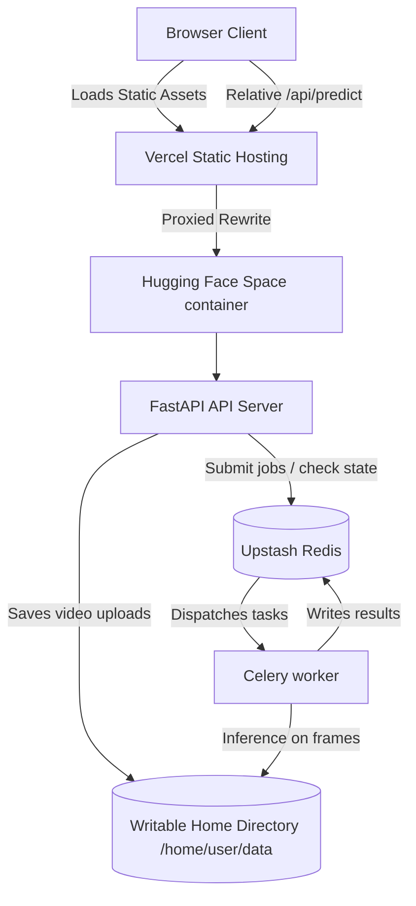

# DeepTrace Deployment Architecture (v2)

This document outlines the deployment setup for DeepTrace, taking it from a local docker-compose environment to a production deploy using Vercel (frontend), Hugging Face Spaces (backend), and Upstash Redis (job queue/broker).

## Live Endpoints

- **Frontend (Vercel)**: `https://deeptrace-frontend.vercel.app` (Placeholder - connected to GitHub repo `obstinix/deeptrace`)
- **Backend (Hugging Face Space)**: `https://obstinix-deeptrace-api.hf.space`

---

## Architecture Overview

DeepTrace is split into two primary components to balance cost, performance, and functional requirements:

1. **Frontend (Vercel)**
   - Hosted as a static site directly from the repo root (`index.html` and `webhooks.html`).
   - Uses `vercel.json` rewrites to proxy all API traffic (`/api/*`) directly to the Hugging Face Space endpoint over HTTPS.
   - Requires zero client-side configuration of API endpoints, avoiding hardcoded backend URLs.

2. **Backend (Hugging Face Space)**
   - Deployed as a single unified **Docker SDK Space** running both the **FastAPI application** and the **Celery worker** concurrently.
   - Runs as a non-root user (UID 1000) under the `/app` workspace directory for security and Hugging Face compatibility.
   - Backed by **Upstash Redis** (free tier) for Celery task queuing (broker) and result backend persistence.
   - Utilizes the writable `/home/user/data` home subdirectory for ephemeral SQLite databases and media storage.

---

## Architectural Decisions & Rationales

### Single Container Co-location (API + Worker)
- **Problem**: Async video jobs require the API server to receive video files, store them, and pass them to the Celery worker. In standard scaled environments, this requires a centralized object storage (like AWS S3 or Cloudflare R2).
- **Solution**: To keep the existing local video job pipeline working without rewriting the backend storage adapter, we run both processes inside the same container sharing a local folder (`/home/user/data/jobs`). Video uploads are saved here where the local worker process reads them directly.
- **Worker Configuration**: Memory usage is optimized by running Uvicorn with `--workers 1` (saving RAM from redundant model registries) and running Celery with `--concurrency=2` on CPU.

### Writable Directory for Non-Root User
- Hugging Face Spaces run as a non-root user (UID 1000). To avoid permission errors when writing SQLite databases or caching model checkpoints, writable paths (`METRICS_DB_PATH`, `DEEPTRACE_DB_PATH`, `DEEPTRACE_UPLOAD_DIR`) must reside under `/home/user/data`.
- This folder is explicitly created and chowned during the Docker build stage.

### Ephemeral Storage & Cold Starts
- **Ephemeral Storage**: SQLite databases reset on space restarts/rebuilds. This is an accepted tradeoff for a portfolio-scale deployment.
- **Cold Start**: Hugging Face free spaces enter sleep mode after inactivity. The first request after a sleep period will experience a cold start while loading PyTorch, MediaPipe, Librosa, SHAP, and checkpoints.

### Sync Pipeline
- A GitHub Action (`.github/workflows/sync-hf-space.yml`) automates deploying to Hugging Face.
- It prepares a deployment directory with a Space-specific `README.md` containing the required Docker SDK metadata and uploads only the backend-relevant code.
- Checking out the repository with Git LFS pulls the checkpoints cleanly, and the Hugging Face API uploads them automatically without remote Git size restriction limits.

---

## Environment Variables Configuration

### Hugging Face Space Repository Secrets

Configure the following secrets in the Hugging Face Space Settings page:

| Variable | Recommended Value / Format | Purpose |
|----------|----------------------------|---------|
| `CELERY_BROKER_URL` | `rediss://default:<password>@<endpoint>:<port>` | Upstash Redis connection URL |
| `CELERY_RESULT_BACKEND` | `rediss://default:<password>@<endpoint>:<port>` | Upstash Redis connection URL |
| `METRICS_DB_PATH` | `/home/user/data/metrics.db` | Path to writable metrics SQLite DB |
| `DEEPTRACE_DB_PATH` | `/home/user/data/deeptrace.db` | Path to writable API Key SQLite DB |
| `DEEPTRACE_UPLOAD_DIR` | `/home/user/data/jobs` | Shared upload folder for video tasks |
| `CORS_ORIGINS` | `<your-vercel-domain-url>` | Allowed origin for frontend requests |
| `PYTHONPATH` | `/app` | Python path setup for module resolution |

---

## Upstash Redis Configuration

- Provisions a free Redis-compatible database on Upstash (SSL enabled).
- Serves as the centralized task broker and result backend.
