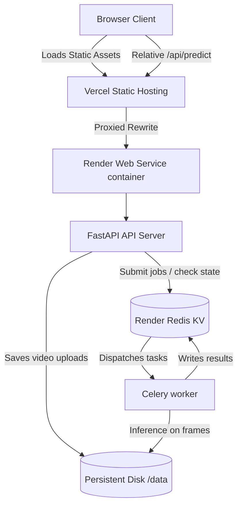

# DeepTrace Deployment Architecture

This document outlines the deployment setup for DeepTrace, taking it from a local docker-compose environment to a live production deploy.

## Live Endpoints

- **Frontend (Vercel)**: `https://deeptrace-frontend.vercel.app` (Placeholder - connected to GitHub repo `obstinix/deeptrace`)
- **Backend (Render)**: `https://deeptrace-backend.onrender.com`

---

## Architecture Overview

DeepTrace is split into two primary components to balance cost, performance, and functional requirements:

1. **Frontend (Vercel)**
   - Hosted as a static site directly from the repo root (`index.html` and `webhooks.html`).
   - Uses `vercel.json` rewrites to proxy all API traffic (`/api/*`) directly to the Render backend service over HTTPS.
   - Requires zero client-side configuration of API endpoints, avoiding hardcoded backend URLs.

2. **Backend (Render)**
   - Deployed as a single unified **Docker Web Service** running both the **FastAPI application** and the **Celery worker** concurrently.
   - Backed by Render's managed **Redis (Key-Value)** instance for message brokering, rate-limiting, and result backend persistence.
   - Utilizes a persistent disk mounted at `/data` to store SQLite databases and uploaded media.

---

## Architectural Decisions & Rationales

### Single Container Co-location (API + Worker)
- **Problem**: Async video jobs require the API server to receive video files, store them, and pass them to the Celery worker. In standard scaled environments, this requires a centralized object storage (like AWS S3 or Cloudflare R2) and a database.
- **Solution**: To keep the existing local video job pipeline working without rewriting the backend storage adapter, we run both processes inside the same container sharing a Render persistent disk mounted at `/data`. Video uploads are saved to `/data/jobs` where the local worker process reads them directly.
- **Worker Configuration**: Memory usage is optimized by running Uvicorn with `--workers 1` (saving RAM from redundant model registries) and running Celery with `--concurrency=2` on CPU.

### Future Scale/Upgrade Path
- If API traffic or video processing load requires scaling the API and worker separately:
  1. Migrate the video storage layer to an S3/R2-compatible Object Storage service.
  2. Modify `worker/tasks.py` and `api/main.py` to upload and fetch files via pre-signed URLs instead of reading from local `/data/jobs` paths.
  3. Decouple the single Render Blueprint into two services: an API Web Service and a separate Celery Worker Private Service.

---

## Environment Variables Configuration

### Render Web Service (`deeptrace-backend`)

The following environment variables are set in the Render Dashboard (or via `render.yaml`):

| Variable | Target Value / Reference | Purpose |
|----------|--------------------------|---------|
| `CELERY_BROKER_URL` | `fromService: type: redis -> connectionString` | Redis broker connection URL |
| `CELERY_RESULT_BACKEND` | `fromService: type: redis -> connectionString` | Redis task state storage URL |
| `METRICS_DB_PATH` | `/data/metrics.db` | Path to persistent SQLite metrics DB |
| `DEEPTRACE_DB_PATH` | `/data/deeptrace.db` | Path to persistent SQLite API Key DB |
| `DEEPTRACE_UPLOAD_DIR` | `/data/jobs` | Shared upload folder for video tasks |
| `CORS_ORIGINS` | `<your-vercel-domain-url>` | Allowed origin for frontend requests |
| `PYTHONPATH` | `/app` | Python path setup for module resolution |

---

## Managed Redis Configuration

- Provisions a managed Key-Value (Redis) instance on Render.
- Shared between the rate limiter and the Celery broker/backend.
- **Flower Dashboard**: Excluded from the initial deploy to minimize attack surface and cost, but can be added as a private service referencing the same Redis KV URL.
