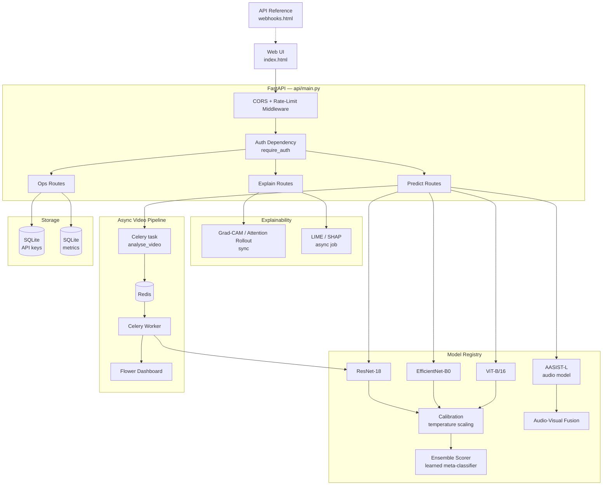
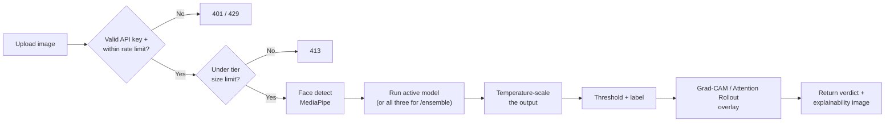

<div align="center">

# DeepTrace

**Multi-modal AI deepfake detection — image, video, and audio forensics with a calibrated, explainable ensemble.**

[](https://github.com/obstinix/deeptrace/actions/workflows/ci.yml)


</div>

---

DeepTrace is a self-hosted deepfake detection service. Three visual architectures and a graph-attention audio model each score an upload independently; a trained meta-classifier fuses their calibrated outputs into a single verdict, and an explainability layer shows why. Everything runs behind a tiered, rate-limited REST API with async support for longer videos.

| 3 vision architectures | 1 audio model | 25 REST endpoints | 52 tests |
|---|---|---|---|
| ResNet-18 · EfficientNet-B0 · ViT-B/16 | AASIST-L | Predict · Explain · Jobs · Keys · Metrics | ruff · pytest · mypy on 3.11 & 3.12 |

> **Responsible use.** DeepTrace produces a probabilistic signal, not forensic-grade certainty. Treat verdicts as one input among several for moderation or investigative decisions, particularly where the outcome affects someone's reputation or rights.

## Table of Contents

- [Overview](#overview)
- [Use Cases](#use-cases)
- [Features](#features)
- [Architecture](#architecture)
- [Tech Stack](#tech-stack)
- [Requirements](#requirements)
- [Quick Start](#quick-start)
- [API Reference](#api-reference)
- [Authentication & Rate Limits](#authentication--rate-limits)
- [Model Performance](#model-performance)
- [Training Your Own Models](#training-your-own-models)
- [Async Video Pipeline & Docker](#async-video-pipeline--docker)
- [Testing & CI](#testing--ci)
- [Repository Structure](#repository-structure)
- [Roadmap](#roadmap)
- [License](#license)
- [Contributing](#contributing)

## Overview

A single request to DeepTrace can trigger any of the following, depending on the endpoint:

- **Visual ensemble** — ResNet-18, EfficientNet-B0, and ViT-B/16 each score the input; a trained logistic-regression meta-classifier fuses their temperature-calibrated outputs into one verdict.
- **Audio spoof detection** — an AASIST-L graph-attention network flags synthetic or cloned voices, with a fusion step that reconciles audio and visual verdicts on video inputs.
- **Group photos** — MediaPipe face detection runs each face through the pipeline independently, then aggregates per-face verdicts (any-fake / majority / weighted / confident-only) into one result.
- **Explainability** — Grad-CAM and Attention Rollout return inline, synchronously. LIME and SHAP are more expensive and run as background jobs you poll for completion.
- **Async video** — longer videos are handed to a Celery worker over Redis instead of blocking the request; job progress is queryable and visible on a Flower dashboard.
- **Tiered access** — every non-public route requires an `X-API-Key` header; free/pro/admin tiers gate rate limits, upload size, and access to the ensemble and explainability endpoints.

## Use Cases

- **Content moderation** — flag likely-synthetic uploads for human review before they reach a feed.
- **Journalism & fact-checking** — a first-pass check on a user-submitted photo, video, or audio clip.
- **Research** — a reference implementation of ensemble fusion, calibration, and multi-modal explainability for deepfake detection.
- **Personal / forensic triage** — a starting signal when verifying whether a specific clip or recording is authentic, ahead of more rigorous analysis.

## Features

| Feature | Status |
|---|---|
| Visual ensemble (ResNet-18 + EfficientNet-B0 + ViT-B/16) | ✅ |
| Learned meta-classifier ensemble fusion | ✅ |
| Per-model temperature-scaled calibration | ✅ |
| Grad-CAM / Attention Rollout explainability (sync) | ✅ |
| LIME / SHAP explainability (async job queue) | ✅ |
| Group photo / multi-face detection (MediaPipe) | ✅ |
| AASIST-L audio deepfake / voice-spoof detection | ✅ |
| Audio-visual verdict fusion | ✅ |
| Async video analysis (Celery + Redis) | ✅ |
| Job monitoring dashboard (Flower) | ✅ |
| Tiered API key auth (free / pro / admin) | ✅ |
| Per-tier rate limiting + feature gating | ✅ |
| Hot-swappable model checkpoints (no restart) | ✅ |
| Interactive API docs (Swagger UI + ReDoc) | ✅ |
| Web UI, light/dark theme | ✅ |
| Docker Compose stack (API + worker + Redis + Flower) | ✅ |
| GitHub Actions CI (ruff + pytest + mypy, 3.11 & 3.12) | ✅ |

## Architecture



### Request lifecycle — `POST /api/predict/image`



## Tech Stack

**Machine learning**

| Library | Version | Role |
|---|---|---|
| PyTorch | 2.5.1 | Core deep learning framework |
| Torchvision | 0.20.1 | Model zoo, transforms |
| timm | 1.0.27 | EfficientNet-B0 and ViT-B/16 architectures |
| OpenCV | 4.10.0.84 | Video frame extraction |
| scikit-learn | 1.3.0 | Ensemble meta-classifier, metrics |
| NumPy | 1.26.4 | Array operations |
| Pillow | 10.4.0 | Image I/O |
| Weights & Biases | 0.27.0 | Training-run logging (optional, training only) |

**API & backend**

| Library | Version | Role |
|---|---|---|
| FastAPI | 0.136.0 | REST API framework |
| Uvicorn | 0.29.0 | ASGI server |
| Pydantic | 2.13.3 | Request/response models |
| pydantic-settings | 2.14.1 | Environment-based config |
| python-multipart | 0.0.26 | File upload parsing |
| slowapi | 0.1.9 | Per-route rate limiting |

**Async, auth & media processing**

| Library | Role |
|---|---|
| Celery | Async video analysis task queue |
| Redis | Celery broker/backend + rate-limit key cache |
| Flower | Celery job monitoring dashboard |
| bcrypt | API key hashing |
| aiosqlite | Async SQLite driver for the key store |
| mediapipe | Face detection for single, group, and video inference |
| soundfile | Audio decoding for the AASIST-L pipeline |

These install alongside `requirements.txt` — see [Quick Start](#quick-start).

**Frontend**

Vanilla HTML/CSS/JS — `index.html` (the detection UI, light/dark theme) and `webhooks.html` (API reference), both served directly by FastAPI.

## Requirements

| Requirement | Notes |
|---|---|
| Python | 3.11+ (CI runs 3.11 and 3.12) |
| Redis | Required — Celery broker/backend and the rate-limit cache both depend on it |
| RAM | 8 GB minimum, 16 GB recommended if running all three visual models concurrently |
| GPU | Optional for inference (CPU works for all three visual models and AASIST-L); recommended for training |
| Disk | ~90 MB for the three committed checkpoints (Git LFS) + space for any dataset you train on |
| Git LFS | Required to clone the real checkpoint weights — see Quick Start |

## Quick Start

**1. Clone the repo (with LFS)**

```bash
git lfs install
git clone https://github.com/obstinix/deeptrace.git
cd deeptrace
```

**2. Create a virtual environment**

```bash
python -m venv venv
source venv/bin/activate   # Windows: venv\Scripts\activate
```

**3. Install dependencies**

```bash
pip install -r requirements.txt

# A few extra runtime dependencies aren't pinned in requirements.txt yet
pip install mediapipe celery redis "bcrypt>=4.0" aiosqlite soundfile
```

**4. Configure environment variables**

```bash
cp .env.example .env
```

A few variables the app reads at runtime aren't in `.env.example` yet — set them if you're using async video or a non-default key store location:

```bash
CELERY_BROKER_URL=redis://localhost:6379/0
CELERY_RESULT_BACKEND=redis://localhost:6379/1
DEEPTRACE_DB_PATH=data/deeptrace.db
```

**5. Start Redis**

```bash
docker run -d -p 6379:6379 redis:7-alpine
# or a local install: redis-server
```

**6. Create an admin API key**

Every route except `/`, `/api/health`, `/api/config`, and the docs (`/docs`, `/redoc`, `/openapi.json`) requires an `X-API-Key` header — there's no anonymous fallback tier.

```bash
python scripts/create_admin_key.py --name "local-dev"
```

The raw key is printed once and stored only as a bcrypt hash — save it now.

**7. (Optional) Start the Celery worker**

Needed for `/api/predict/video` (async) and `/api/jobs/*`. `/api/predict/video/sync` works without it.

```bash
celery -A celery_app worker --loglevel=info --concurrency=2 --queues=video,default
```

**8. Start the API**

```bash
bash start.sh          # macOS / Linux
start.bat               # Windows
# or manually:
uvicorn api.main:app --host 0.0.0.0 --port 8000 --reload
```

**9. Open it**

```
http://localhost:8000            # Web UI
http://localhost:8000/webhooks    # API reference
```

Pass your key as `X-API-Key: <your_key>` on every authenticated request.

### Or: the whole stack via Docker Compose

```bash
docker compose up --build
```

Brings up Redis, the Celery worker, Flower, and the API together. You'll still need to run `create_admin_key.py` inside the API container once it's up.

## API Reference

**Base URL:** `http://localhost:8000` · **Auth header:** `X-API-Key: <key>` (omit only for the public paths below)

| Method | Path | Auth | Description |
|---|---|---|---|
| `GET` | `/api/health` | Public | Service, model, Redis, and queue status |
| `GET` | `/api/config` | Public | Runtime config consumed by the web UI |
| `POST` | `/api/predict/image` | Key | Single-image verdict from the active model |
| `POST` | `/api/predict/ensemble` | Pro/Admin | Fused verdict across all three visual models |
| `POST` | `/api/predict/group` | Key | Multi-face group photo — per-face verdict + aggregate |
| `POST` | `/api/predict/video/sync` | Key | Synchronous video verdict (blocks until done) |
| `POST` | `/api/predict/video` | Key | Submits a video to the async Celery queue |
| `GET` | `/api/jobs/{job_id}` | Key | Poll an async video job |
| `GET` | `/api/jobs` | Key | List jobs for the calling key |
| `POST` | `/api/jobs/{job_id}/cancel` | Key | Cancel a queued or running job |
| `POST` | `/api/predict/audio` | Key | Voice deepfake / spoof detection (AASIST-L) |
| `POST` | `/api/explain` | Pro/Admin | Submit a LIME/SHAP async explanation job |
| `GET` | `/api/explain/{job_id}` | Key | Poll a LIME/SHAP job |
| `GET` | `/api/models` | Key | List loaded models and metadata |
| `POST` | `/api/model/load` | Key | Load a specific architecture into the registry |
| `POST` | `/api/model/reload` | Key | Hot-swap a checkpoint without restarting |
| `POST` | `/api/model/calibrate` | Key | Fit/refresh temperature scaling for a model |
| `POST` | `/api/ensemble/reload` | Admin | Reload `checkpoints/ensemble/weights.json` |
| `POST` | `/api/compare` | Key | Run all models on one input, side by side |
| `POST` | `/api/keys` | Admin | Issue a new API key |
| `GET` | `/api/keys` | Admin | List all keys |
| `DELETE` | `/api/keys/{key_id}` | Admin | Revoke a key |
| `GET` | `/api/keys/me/usage` | Key | Caller's own usage stats |
| `GET` | `/api/keys/{key_id}/usage` | Admin | Usage stats for any key |
| `GET` | `/api/metrics` | Key | Aggregate request/error/latency counters |

### Example — health check

```bash
curl http://localhost:8000/api/health
```

```json
{
  "status": "ok",
  "model_loaded": true,
  "audio_model_loaded": true,
  "audio_checkpoint": "checkpoints/audio/aasist_l.pth",
  "explain_queue_pending": 0,
  "ensemble_strategy": "learned",
  "ensemble_fitted": true,
  "redis_connected": true,
  "video_queue_depth": 0,
  "auth_enabled": true,
  "version": "0.1.0",
  "uptime_seconds": 4213
}
```

### Example — ensemble verdict

```bash
curl -X POST http://localhost:8000/api/predict/ensemble \
  -H "X-API-Key: $DEEPTRACE_KEY" \
  -F "file=@sample.jpg"
```

```json
{
  "prediction": "fake",
  "confidence": 0.91,
  "mode": "ensemble",
  "calibration_applied": true,
  "per_model": {
    "resnet18": { "prediction": "fake", "confidence": 0.55 },
    "efficientnet_b0": { "prediction": "fake", "confidence": 0.97 },
    "vit_b16": { "prediction": "fake", "confidence": 0.88 }
  }
}
```

### Example — Python client

```python
import requests

BASE_URL = "http://localhost:8000"
headers = {"X-API-Key": "your_key_here"}

with open("sample.jpg", "rb") as f:
    response = requests.post(
        f"{BASE_URL}/api/predict/ensemble",
        headers=headers,
        files={"file": f},
    )

result = response.json()
print(result["prediction"], result["confidence"])
```

### Example — async explanation job

```bash
# 1. Submit the job
curl -X POST http://localhost:8000/api/explain \
  -H "X-API-Key: $DEEPTRACE_KEY" \
  -F "file=@sample.jpg" -F "method=shap"

# → { "job_id": "exp_8f2a1c", "status": "queued", "method": "shap" }

# 2. Poll for the result
curl http://localhost:8000/api/explain/exp_8f2a1c \
  -H "X-API-Key: $DEEPTRACE_KEY"
```

Response shapes above are abbreviated for readability — full interactive docs are at `/docs` (Swagger) and `/redoc` once the server is running.

## Authentication & Rate Limits

Every route outside the public set (`/`, `/api/health`, `/api/config`, `/docs`, `/redoc`, `/openapi.json`) requires an `X-API-Key` header. Keys are bcrypt-hashed at rest, validated against SQLite with a short-lived Redis cache for repeat requests, and scoped to one of three tiers:

| Tier | Req/min | Req/hour | Req/day | Max image | Max video | Ensemble | Explain (LIME/SHAP) | Manage keys |
|---|---|---|---|---|---|---|---|---|
| `free` | 10 | 100 | 500 | 10 MB | 100 MB | ❌ | ❌ | ❌ |
| `pro` | 60 | 1,000 | 10,000 | 50 MB | 2,000 MB | ✅ | ✅ | ❌ |
| `admin` | 600 | 100,000 | 1,000,000 | 500 MB | 10,000 MB | ✅ | ✅ | ✅ |

Bootstrap your first key with:

```bash
python scripts/create_admin_key.py --name "admin"
```

Admins can then issue scoped keys via `POST /api/keys`.

## Model Performance

Evaluated on a held-out Celeb-DF v2 test split via `training/evaluate.py`. The ensemble score reflects a logistic-regression meta-classifier fit on top of all three models' calibrated outputs via `training/fit_ensemble.py`.

| Model | Test Accuracy | AUC-ROC | Params | Explainability | Epochs Trained |
|---|---|---|---|---|---|
| ResNet-18 | 100.0% | 1.000 | 11.3M | Grad-CAM | 10 |
| EfficientNet-B0 | 96.3% | 0.994 | 4.0M | Grad-CAM | 3 |
| ViT-B/16 | 90.2% | 0.952 | 85.8M | Attention Rollout | 2 |
| **Ensemble (learned)** | **96.7%** | **0.998** | — | Per-model breakdown | — |

## Training Your Own Models

Configs live in `training/configs/`: `resnet18.yaml`, `efficientnet_b0.yaml`, `efficientnet_b3.yaml`, `vit_b16.yaml`, `vit_base.yaml`, `ensemble.yaml`.

```bash
# 1. Extract frames from raw Celeb-DF v2 video folders
python scripts/prepare_dataset.py \
  --input data/raw --output data/frames \
  --fps 1.0 --max-frames 30 \
  --real-dirs "Celeb-real,YouTube-real" --fake-dirs "Celeb-synthesis"

# 2. Train an architecture
python training/train.py --config training/configs/resnet18.yaml

# 3. Evaluate on the held-out split
python training/evaluate.py \
  --checkpoint checkpoints/resnet18/best.pth \
  --config training/configs/resnet18.yaml \
  --data data/frames --split test

# 4. Fit temperature scaling (one model, or --all)
python training/calibrate.py --all --device cuda

# 5. Fit the ensemble meta-classifier
python training/fit_ensemble.py --strategy learned --device cuda
```

Step 5 writes `checkpoints/ensemble/weights.json` and `logs/ensemble/fit_report.json` — the same files the API reads at startup.

## Async Video Pipeline & Docker

`docker-compose.yml` defines four services: `api`, `celery_worker`, `redis`, and `flower`. The worker (`worker/tasks.py`) pulls jobs off the `video` queue, extracts frames, runs them through the model registry, tracks progress, and writes results the API exposes via `GET /api/jobs/{job_id}`. Flower gives you a live view of queue depth and task history — bring it up alongside the stack with `docker compose up --build`.

## Testing & CI

```bash
pip install -r requirements-dev.txt
pytest
```

52 test functions across 12 files in `tests/`. `.github/workflows/ci.yml` runs `ruff` (lint), `pytest`, and `mypy` on Python 3.11 and 3.12 for every push and pull request.

## Repository Structure

```
deeptrace/
├── api/
│   ├── main.py                 # FastAPI app and all live routes
│   ├── db.py                    # Metrics SQLite helpers
│   ├── auth/
│   │   ├── keys.py                # bcrypt key hashing, SQLite key store
│   │   ├── middleware.py           # require_auth / require_admin / require_feature
│   │   ├── ratelimit.py             # Redis-backed sliding-window limiter
│   │   └── tiers.py                  # free / pro / admin tier definitions
│   └── routes/                    # predict.py / model.py / system.py
├── src/deepfake_recognition/
│   ├── models/ensemble.py          # Learned meta-classifier fusion
│   ├── audio/
│   │   ├── audio_model.py            # AASIST-L
│   │   ├── audio_pipeline.py
│   │   └── audio_fusion.py            # Audio-visual fusion strategies
│   ├── inference/                    # Prediction pipelines
│   └── utils/
│       ├── model_factory.py            # Architecture registry
│       ├── face_pipeline.py             # MediaPipe face detection
│       ├── multi_face.py                 # Group photo aggregation
│       ├── calibration.py                 # Temperature scaling
│       └── explainability/
│           ├── router.py                   # Fast vs. slow method dispatch
│           ├── gradcam.py
│           ├── attention_rollout.py
│           ├── lime_explainer.py
│           └── shap_explainer.py
├── worker/
│   ├── tasks.py                  # Celery task: analyse_video
│   └── storage.py                 # Redis-backed job artifact storage
├── training/
│   ├── train.py / evaluate.py / calibrate.py / fit_ensemble.py
│   └── configs/                   # One YAML per architecture + ensemble.yaml
├── checkpoints/                    # Git-LFS tracked (.pth)
│   ├── resnet18/best.pth
│   ├── efficientnet_b0/best.pth
│   ├── vit_b16/best.pth
│   └── ensemble/weights.json
├── logs/                            # Eval reports, confusion matrices, ROC curves
├── scripts/
│   ├── prepare_dataset.py
│   ├── create_admin_key.py
│   ├── verify_auth.py
│   └── upload_model_hub.py
├── tests/                            # 52 tests across 12 files
├── notebooks/
├── index.html                          # Web UI
├── webhooks.html                        # API reference / docs page
├── celery_app.py
├── docker-compose.yml
├── Dockerfile
├── requirements.txt
├── requirements-dev.txt
├── pyproject.toml
└── LICENSE
```

## Roadmap

- [ ] Train `efficientnet_b3` and `vit_base` variants (configs already in place)
- [ ] Implement webhook delivery to match the API reference docs
- [ ] Populate `notebooks/` with data-exploration and training walkthroughs
- [ ] Expand test coverage around the async video pipeline
- [ ] Public deployment

## License

This project is licensed under the MIT License — see [`LICENSE`](LICENSE) for details.

## Contributing

Issues and PRs are welcome. For larger changes, open an issue first to discuss the approach.

---

<div align="center">

Built by [Piyush Pandey](https://github.com/obstinix)

</div>
