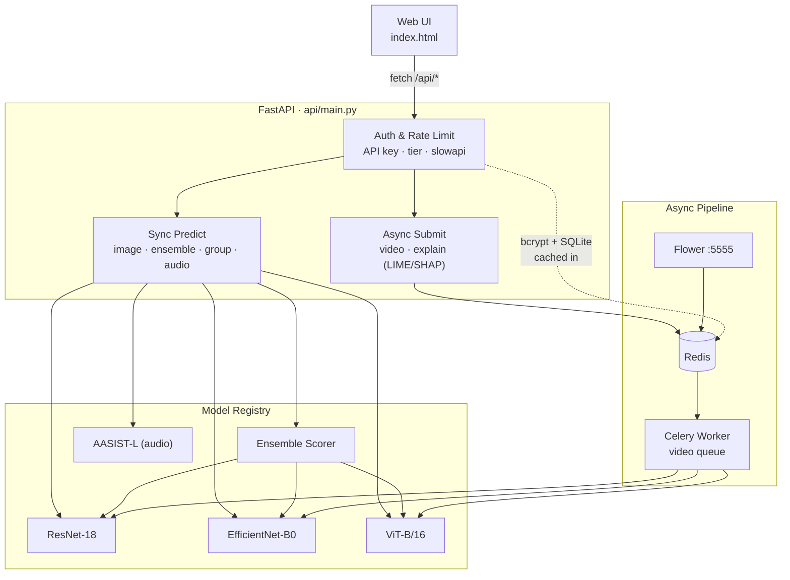
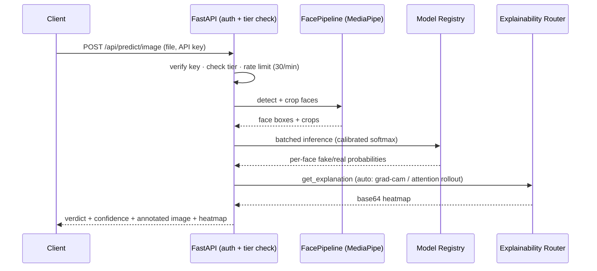

<div align="center">


# DeepTrace

### Multi-Modal AI Deepfake Detection Platform

**Ensemble image, video, and audio forensics — with calibrated confidence and visual explanations for every verdict**

<br/>

[](https://github.com/obstinix/deeptrace)
[](https://www.python.org/)
[](https://pytorch.org/)
[](https://fastapi.tiangolo.com/)
[](./LICENSE)
[](https://github.com/obstinix/deeptrace/commits/main)
[](https://github.com/obstinix/deeptrace/issues)

<br/>

> 🟢 **The core platform is feature-complete and live:** face-aware image detection, video (sync + async), group photos, audio spoof detection, a 3-model ensemble, full explainability, and tiered API auth are all wired and working. A handful of housekeeping gaps remain — see [Known Issues](#-known-issues) before you deploy this anywhere that matters.

<br/>

[Features](#-features) · [Architecture](#-system-architecture) · [Tech Stack](#-tech-stack) · [Quick Start](#-quick-start) · [API Reference](#-api-reference) · [Model Performance](#-model-training--performance) · [Known Issues](#-known-issues) · [Roadmap](#-roadmap) · [Contributing](#-contributing)

</div>

---

## 🔍 What is DeepTrace?

DeepTrace is a multi-modal deepfake detection platform. It analyses **images, videos, group photos, and audio** for signs of AI manipulation, using an ensemble of vision models plus a dedicated audio anti-spoofing network — with calibrated confidence scores and a visual explanation for every verdict, so nothing is a black box.

- **Tiered, API-key-authenticated REST API** (FastAPI) with per-key rate limiting and usage tracking
- **3-model ensemble** — ResNet-18, EfficientNet-B0, ViT-B/16 — combined via weighted-average or a learned meta-classifier
- **Audio deepfake detection** via AASIST-L, a graph-attention anti-spoofing network, for voice cloning / synthesis detection
- **Face-aware inference** (MediaPipe) including group-photo analysis with per-face verdicts and configurable aggregation
- **Fast, synchronous explainability** (Grad-CAM, Attention Rollout) and **slow, asynchronous explainability** (LIME, SHAP) via a job-queue pattern
- **Async video pipeline** (Celery + Redis + Flower) separate from the synchronous single-shot endpoint
- **Temperature-scaled confidence calibration**, tracked via Expected Calibration Error (ECE)
- **Model hot-swap and ensemble-weight reload** — no server restart required

DeepTrace targets the same real-world users as before — journalists verifying media, platforms moderating UGC, security researchers — but the surface area has grown well past a single image classifier.

---

## ✨ Features

| Feature | Status |
|---|---|
| Image detection — face-aware, multi-model | ✅ Live |
| Group / multi-face photo analysis | ✅ Live |
| Video detection — synchronous endpoint | ✅ Live |
| Video detection — async via Celery queue | ✅ Live |
| Audio deepfake detection (AASIST-L) | ✅ Live |
| Ensemble scoring (weighted-average / learned meta-classifier) | ✅ Live |
| Grad-CAM & Attention Rollout (fast, synchronous) | ✅ Live |
| LIME & SHAP (slow, async job + polling) | ✅ Live |
| Confidence calibration (temperature scaling + ECE) | ✅ Live |
| Tiered API-key auth (free / pro / admin) | ✅ Live |
| Per-key rate limiting & usage tracking | ✅ Live |
| Model hot-swap / ensemble reload, no restart | ✅ Live |
| Docker Compose full stack (API + worker + Redis + Flower) | ✅ Live |
| CI — lint, type-check, tests on Python 3.11 & 3.12 | ✅ Live |
| 52-test pytest suite across 12 modules | ✅ Live |
| `api/routes/*.py` modular router migration | 🟡 Started, not wired in |
| Public hosted deployment | 🔄 Not yet |
| `requirements.txt` fully in sync with actual imports | 🔴 Gaps — see Known Issues |
| `LICENSE` file populated | 🔴 Empty — see Known Issues |

---

## 🏗️ System Architecture



### Request lifecycle — `POST /api/predict/image`



If no face is detected, the pipeline falls back to whole-frame inference rather than failing.

---

## 🧰 Tech Stack

### Machine Learning
| Library | Version | Role |
|---|---|---|
| PyTorch | 2.5.1 | Deep learning framework |
| Torchvision | 0.20.1 | Model zoo, transforms |
| timm | 1.0.27 | EfficientNet / ViT backbones |
| OpenCV | 4.10.0 | Video frame extraction, image ops |
| scikit-learn | 1.3.0 | Metrics, calibration, ensemble meta-classifier |
| NumPy | 1.26.4 | Array operations |
| Pillow | 10.4.0 | Image I/O |
| MediaPipe | *unpinned* | Face detection — see [Known Issues](#-known-issues) |

### Audio
| Component | Role |
|---|---|
| AASIST-L | Graph-attention audio anti-spoofing network |
| soundfile | Audio decoding — *unpinned*, see [Known Issues](#-known-issues) |

### Backend & API
| Library | Version | Role |
|---|---|---|
| FastAPI | 0.136.0 | REST API framework |
| Uvicorn | 0.29.0 | ASGI server |
| python-multipart | 0.0.26 | File upload parsing |
| slowapi | 0.1.9 | Per-endpoint / per-key rate limiting |
| pydantic / pydantic-settings | 2.13.3 / 2.14.1 | Request/response models, settings |

### Auth & Async Jobs
| Component | Role |
|---|---|
| bcrypt *(unpinned)* | API key hashing |
| aiosqlite *(unpinned)* | Async SQLite store for keys + usage |
| Celery *(unpinned)* | Async video job queue |
| Redis *(unpinned)* | Celery broker/backend **and** auth-cache — required even outside Docker |
| Flower *(unpinned)* | Celery task monitoring dashboard (`:5555`) |

### Explainability
| Method | Speed | Notes |
|---|---|---|
| Grad-CAM | Fast, synchronous | `utils/gradcam.py` |
| Attention Rollout | Fast, synchronous | `utils/attention_rollout.py`, ViT only |
| LIME | Slow, async job | `lime` package — likely also unpinned, see Known Issues |
| SHAP | Slow, async job | `shap` package — likely also unpinned, see Known Issues |

### Frontend
| Technology | Role |
|---|---|
| HTML5 / CSS3 / vanilla JS | `index.html` — main UI, light/dark theme |
| Static HTML | `webhooks.html` — secondary docs / "whitepaper" page linked from the UI |

### Infrastructure
| Tool | Role |
|---|---|
| Docker + docker-compose | Multi-service stack: `api`, `celery_worker`, `redis`, `flower` |
| GitHub Actions | CI — ruff, mypy, pytest on Python 3.11 & 3.12 |
| Git LFS | *Declared* for `*.pth` in `.gitattributes`, not actually applied — see Known Issues |

---

## 💻 Requirements

```
Python          3.11+   (pyproject.toml pins >=3.11; CI runs 3.11 & 3.12)
CUDA            12.8+   (for GPU training)
PyTorch         2.5.1   (CUDA 12.8 build recommended)
RAM             8 GB minimum, 16 GB recommended
GPU (training)  8 GB VRAM minimum
GPU (inference) CPU is fine
Redis           required — Celery broker/backend + auth key cache
Disk            ~90 MB for checkpoints (committed directly, not LFS) + dataset space
```

**Supported OS:** Windows 10/11 · Ubuntu 20.04+ · macOS 13+

---

## ⚡ Quick Start

### 1. Clone
```bash
git clone https://github.com/obstinix/deeptrace.git
cd deeptrace
```

### 2. Create a virtual environment
```bash
python -m venv venv

# Windows
venv\Scripts\activate

# macOS / Linux
source venv/bin/activate
```

### 3. Install dependencies
```bash
pip install -r requirements.txt
```
> ⚠️ `requirements.txt` doesn't currently list everything the code actually imports. Also install:
> ```bash
> pip install celery redis aiosqlite bcrypt soundfile huggingface_hub mediapipe lime shap
> ```
> See [Known Issues](#-known-issues) for details.

### 4. Start Redis
Redis backs both the Celery queue and the auth-key cache, so the app needs it running even if you're not touching video or auth:
```bash
redis-server
```

### 5. Bootstrap an admin API key (first run only)
```bash
python scripts/create_admin_key.py --name "admin"
```

### 6. Start the Celery worker (for async video jobs)
```bash
celery -A celery_app worker --loglevel=info --concurrency=2 --queues=video,default
```

### 7. Start the API
```bash
# Windows
start.bat

# macOS / Linux
bash start.sh

# Manual
uvicorn api.main:app --host 0.0.0.0 --port 8000 --reload
```

### 8. Open the app
```
http://localhost:8000
```

### Or: everything at once with Docker Compose
```bash
docker-compose up --build
```
Brings up `redis`, `celery_worker`, `flower` (`:5555`), and `api` (`:8000`) together.

---

## 📡 API Reference

Base URL: `http://localhost:8000`. Every endpoint except `/api/health` requires an `X-API-Key` header — see [Auth & Rate Limiting](#-auth--rate-limiting).

### Endpoint summary

| Method | Endpoint | Auth | Purpose |
|---|---|---|---|
| GET | `/api/health` | none | Liveness + which models are loaded |
| GET | `/api/models` | key | List loaded models & metadata |
| GET | `/api/model/info` | key | Detail on one architecture |
| POST | `/api/model/reload` | admin | Hot-swap a checkpoint |
| POST | `/api/predict/image` | key | Face-aware image verdict + explainability |
| POST | `/api/predict/group` | key | Group photo → per-face verdicts + aggregate |
| POST | `/api/predict/ensemble` | key (`can_use_ensemble`) | Fuse all loaded models into one verdict |
| POST | `/api/predict/video/sync` | key | Synchronous video analysis |
| POST | `/api/predict/video` | key | Submit video to the async Celery queue |
| POST | `/api/predict/audio` | key | AASIST-L voice spoof detection |
| POST | `/api/explain` | key (`can_use_explain`) | Submit an async LIME/SHAP job |
| GET | `/api/explain/{job_id}` | key | Poll an explanation job (300s TTL) |
| POST | `/api/ensemble/reload` | admin | Reload ensemble weights from `weights.json` |
| — | `/api/keys*` | admin | Create / list / revoke keys, per-key usage |

### `POST /api/predict/image`
Runs MediaPipe face detection first; falls back to whole-frame inference if no face is found. Rate-limited to 30 requests/minute.

Query params: `model` (default architecture) · `face_detect` (default `true`) · `max_faces` (default `5`) · `explain_method` (`auto` | `grad_cam` | `attention_rollout` | `lime` | `shap` — the slow methods are rejected synchronously with a `422` pointing at `/api/explain`).

```json
{
  "label": "fake",
  "prediction": "fake",
  "confidence": 0.94,
  "architecture": "resnet18",
  "mode": "face_detect",
  "faces_detected": 1,
  "faces_analysed": 1,
  "fake_face_indices": [0],
  "annotated_image": "<base64 PNG>",
  "calibration": { "calibrated": true, "temperature": 1.42, "ece_improvement": 0.031 },
  "explainability": "<base64 heatmap>",
  "explainability_method": "grad_cam",
  "probabilities": { "fake": 0.94, "real": 0.06 },
  "processing_ms": 187.4
}
```

### `POST /api/predict/ensemble`
Fuses every loaded model's calibrated probability into a single verdict.

Query params: `strategy` (`auto` | `weighted_average` | `learned`) · `threshold` (default `0.5`).

```json
{
  "prediction": "fake",
  "confidence": 0.91,
  "mode": "ensemble",
  "ensemble": { "strategy": "learned", "ensemble_fake_prob": 0.91, "threshold": 0.5, "verdict": "fake" },
  "per_model": {
    "resnet18":        { "fake_prob": 0.99, "verdict": "fake", "calibrated": true },
    "efficientnet_b0":  { "fake_prob": 0.87, "verdict": "fake", "calibrated": true },
    "vit_b16":          { "fake_prob": 0.83, "verdict": "fake", "calibrated": true }
  },
  "n_models_loaded": 3,
  "calibration_applied": true
}
```

### `POST /api/predict/group`
Detects every face in a photo, runs inference on each, and aggregates with a configurable strategy.

Query params: `model` · `min_confidence` · `min_face_fraction` · `iou_threshold` · `max_faces` (default `20`) · `strategy` (`any_fake` | `majority` | `weighted` | `confident`) · `confidence_threshold` · `include_crops` · `include_explainability`.

Falls back to whole-frame inference (with a `warning` field) if MediaPipe finds no faces.

### `POST /api/predict/audio`
Accepts `.mp3 .wav .flac .m4a .ogg .aac .wma .opus`. Returns `"spoof"` or `"bonafide"` — standard ASVspoof-style terminology — backed by AASIST-L.

Query params: `aggregate` (`mean` | `majority` | `max_spoof`).

```json
{
  "prediction": "spoof",
  "confidence": 0.88,
  "mode": "audio_only",
  "audio_result": { "...": "per-segment scores" }
}
```

### `POST /api/explain` + `GET /api/explain/{job_id}`
LIME and SHAP are too slow for a synchronous response (SHAP especially), so they run as background jobs:

```json
// POST /api/explain
{
  "job_id": "a1b2c3",
  "status": "pending",
  "method": "shap",
  "poll_url": "/api/explain/a1b2c3",
  "estimated_seconds": 18
}
```
Poll `GET /api/explain/{job_id}` until `status` isn't `"pending"`. Jobs expire after 300 seconds.

---

## 🏋️ Model Training & Performance

### Dataset
All three checkpoints below are currently trained on **Celeb-DF v2**. Scripts also exist for FaceForensics++ (`scripts/download_faceforensics.py`) and a Kaggle DFDC merge (`training/merge_kaggle_dataset.py`) if you want to extend training.

### Train a model
```bash
python training/train.py --config training/configs/resnet18.yaml
```
Configs exist for `resnet18`, `efficientnet_b0`, `efficientnet_b3` *(untrained)*, `vit_b16`, `vit_base` *(untrained)*, and `ensemble`.

### Fit the ensemble meta-classifier
```bash
python training/fit_ensemble.py
```

### Calibrate
```bash
python training/calibrate.py --config training/configs/<name>.yaml
```

### Current performance

| Model | Test Acc | AUC-ROC | Params | Epochs | Explainability |
|---|---|---|---|---|---|
| ResNet-18 | 100.0% ⚠️ | 1.000 ⚠️ | 11.3M | 10 | Grad-CAM |
| EfficientNet-B0 | 96.3% | 0.994 | 4.0M | 3 | Grad-CAM |
| ViT-B/16 | 90.2% | 0.952 | 85.8M | 2 | Attention Rollout |
| **Ensemble (learned)** | **96.7%** | **0.998** | — | — | Per-model breakdown |

⚠️ **ResNet-18's standalone number is very likely inflated.** See [Known Issues](#-known-issues) — don't cite it externally until it's re-verified.

---

## 🔬 Explainability

Every prediction can come with a visual explanation of *why*, routed automatically by speed:

- **Fast, synchronous** (`grad_cam`, `attention_rollout`) — returned inline with the prediction. `auto` picks Grad-CAM for the CNNs and Attention Rollout for ViT.
- **Slow, asynchronous** (`lime`, `shap`) — submitted as a background job via `/api/explain`, cached for 300 seconds, and tunable: LIME takes sample count / superpixel count / top-k; SHAP takes background-sample count / eval count.

---

## 🔑 Auth & Rate Limiting

- API keys are bcrypt-hashed and stored in SQLite (`aiosqlite`) — the raw key is shown once at creation and never stored again.
- Validation is cached in Redis so authenticated requests don't pay the ~100ms bcrypt cost on every call.
- Three tiers — `free`, `pro`, `admin` — gate max upload size and feature access (e.g. `can_use_ensemble`, `can_use_explain`); exact limits live in `api/auth/tiers.py`.
- Per-key, per-day, per-endpoint usage is tracked and exposed via an admin usage endpoint.
- Confirmed limit: `/api/predict/image` is capped at 30 requests/minute via `slowapi`.

```bash
# Bootstrap your first key
python scripts/create_admin_key.py --name "admin"

# Verify the whole auth + rate-limit flow end-to-end
python scripts/verify_auth.py
```

---

## 📁 Repository Structure

```
deeptrace/
├── api/
│   ├── main.py                    # FastAPI app + nearly all live endpoints (~1.8K lines)
│   ├── db.py · middleware.py
│   ├── auth/
│   │   ├── keys.py                 # API key store — SQLite + bcrypt, Redis-cached
│   │   ├── middleware.py           # require_auth / require_admin / require_feature
│   │   ├── ratelimit.py            # slowapi + Redis
│   │   └── tiers.py                # free / pro / admin definitions
│   └── routes/                     # predict.py, model.py, system.py — NOT wired into main.py (see Known Issues)
│
├── src/deepfake_recognition/        # core package (name predates the "deeptrace" repo rename)
│   ├── models/                      # resnet.py · efficientnet.py · vit.py · ensemble.py
│   ├── audio/                       # audio_model.py (AASIST) · audio_pipeline.py · audio_fusion.py
│   ├── inference/                   # predictor.py · video.py
│   ├── data/                        # dataset.py · splitter.py · transforms.py
│   ├── training/                    # trainer.py · callbacks.py · metrics.py
│   └── utils/
│       ├── explainability/          # router.py · lime_explainer.py · shap_explainer.py · explainability_cache.py
│       ├── gradcam.py · attention_rollout.py · calibration.py
│       ├── face_pipeline.py · multi_face.py
│       └── model_factory.py · config.py · logger.py
│
├── worker/                          # Celery task definitions, job progress, temp-file storage
├── celery_app.py                    # Celery app + Redis broker/backend config
│
├── training/
│   ├── configs/                     # per-architecture YAML configs
│   └── train.py · evaluate.py · calibrate.py · fit_ensemble.py
│
├── checkpoints/                     # resnet18/ · efficientnet_b0/ · vit_b16/ · ensemble/
├── logs/                            # eval_report.json, training_history.json, confusion matrices, ROC curves
│
├── tests/                           # 52 tests across 12 files
├── scripts/                         # dataset download/prep, admin key bootstrap, auth verification, HF upload
│
├── index.html                       # main web UI
├── webhooks.html                    # secondary docs / "whitepaper" page, linked from the UI
│
├── Dockerfile · docker-compose.yml  # redis + celery_worker + flower + api
├── .github/workflows/ci.yml
├── pyproject.toml · requirements.txt · requirements-dev.txt
├── start.sh · start.bat
└── README.md
```

---

## ⚠️ Known Issues

Found while auditing the repo for this README refresh — none of these are hard to fix, but they're worth doing before you rely on this in front of anyone else.

1. **`LICENSE` is empty.** `pyproject.toml` declares `license = {text = "MIT"}`, but the actual `LICENSE` file has no text in it, so GitHub reports the repo as unlicensed (`NOASSERTION`). Fix: paste the standard MIT text into `LICENSE`.
2. **`requirements.txt` is missing real runtime dependencies.** Confirmed missing — imported directly in the code, absent from `requirements.txt`, `requirements-dev.txt`, and `pyproject.toml`: `celery`, `redis`, `aiosqlite`, `bcrypt`, `soundfile`, `huggingface_hub`, `mediapipe`. `lime` and `shap` are also almost certainly missing (the explainer modules are named after them). A clean `pip install -r requirements.txt` isn't enough to run auth, async jobs, audio detection, or slow explainability. Fix: `pip install celery redis aiosqlite bcrypt soundfile huggingface_hub mediapipe lime shap`, then pin them properly in `requirements.txt`.
3. **`api/routes/{predict,model,system}.py` aren't wired in.** They define real FastAPI routers, but `api/main.py` never calls `app.include_router(...)` on them — it only imports the `limiter` object from `predict.py`. Every live endpoint is defined directly inside `api/main.py` instead. Either finish the migration or remove the unused routers so they don't mislead the next contributor.
4. **Checkpoints aren't actually in Git LFS.** `.gitattributes` declares `*.pth filter=lfs diff=lfs merge=lfs -text`, but the three `.pth` files (~88MB total) are committed as regular blobs, not LFS pointers — so every clone pulls the full binaries. Either migrate them into LFS properly or drop the `.gitattributes` line so it stops overpromising.
5. **ResNet-18's 100% accuracy is probably leakage, not skill.** `logs/eval_report.json` shows 100% test accuracy and AUC 1.000, but the same checkpoint scores an AUC of 0.41 — worse than random — inside `logs/ensemble/fit_report.json`'s own validation pass. The likely cause is frame-level leakage: adjacent frames from the same video landing in both train and test splits, letting the model memorize identity instead of learning manipulation artifacts. Re-split at the video level (not frame level) before trusting either number.

---

## 🗺️ Roadmap

### Shipped
- [x] Multi-model ensemble — ResNet-18, EfficientNet-B0, ViT-B/16
- [x] Audio deepfake detection (AASIST-L)
- [x] Group / multi-face photo analysis
- [x] Grad-CAM, Attention Rollout, LIME, SHAP
- [x] Temperature-scaled calibration
- [x] Tiered, rate-limited API-key auth
- [x] Async video pipeline (Celery + Redis + Flower)
- [x] Docker Compose full stack
- [x] CI — lint, type-check, tests

### Next
- [ ] Work through [Known Issues](#-known-issues) — license, dependencies, dead routers, LFS, the ResNet-18 leakage check
- [ ] Video-level train/val/test re-split for all three models
- [ ] Train the untrained configs (`efficientnet_b3`, `vit_base`) and compare
- [ ] Public hosted deployment
- [ ] Model-selection UI in the frontend

---

## 🤝 Contributing

```bash
# Fork and clone
git clone https://github.com/YOUR_USERNAME/deeptrace.git
cd deeptrace

# Create a feature branch
git checkout -b feature/your-feature-name

# Make changes, then commit
git add .
git commit -m "feat: describe your change clearly"

# Push and open a PR
git push origin feature/your-feature-name
```

### Where help is most useful right now
- The five items in [Known Issues](#-known-issues)
- Training the untrained model configs
- Wiring up (or removing) `api/routes/*.py`
- Deployment docs for a public instance

### Commit message format
```
[P1] feat: train EfficientNet-B3 on Celeb-DF
[Fix] bug: pin missing runtime dependencies
[Docs] update accuracy table after re-split
```

---

## 🔐 Security & Privacy

- API keys are bcrypt-hashed, shown once at creation, and cached in Redis for fast validation.
- `.env`, `kaggle.json`, and all token files are gitignored.
- Images are processed in memory. Video jobs write to a shared temp directory (`/tmp/deeptrace_jobs`) so the Celery worker can read them across the process boundary — see `worker/storage.py` for retention behavior.
- Model checkpoints are meant to be tracked via Git LFS rather than committed directly — see [Known Issues](#-known-issues) for the current gap.

---

## 📄 License

Declared as **MIT** in `pyproject.toml`, but the `LICENSE` file itself is currently empty — see [Known Issues](#-known-issues). Add the MIT text to `LICENSE` to make that official.

---

## 👤 Author

**obstinix**
[github.com/obstinix](https://github.com/obstinix)

---

<div align="center">

**DeepTrace** — Because seeing shouldn't always mean believing.

[](https://github.com/obstinix/deeptrace/stargazers)
[](https://github.com/obstinix/deeptrace/network/members)

</div>
